<picture>
  <source media="(prefers-color-scheme: dark)" srcset="assets/ascii-avatar-dark.svg" />
  <source media="(prefers-color-scheme: light)" srcset="assets/ascii-avatar-light.svg" />
  
</picture>

<picture>
  <source media="(prefers-color-scheme: dark)" srcset="https://readme-typing-svg.demolab.com?font=Fira+Code&weight=600&size=22&duration=3000&pause=900&color=C9D1FF&center=true&vCenter=true&width=560&lines=Tecn%C3%B3logo+en+Redes+de+Datos+%F0%9F%8C%90;IA+Ag%C3%A9ntica+%C2%B7+n8n+%C2%B7+APIs+%C2%B7+Webhooks;Automatizo+lo+que+otros+hacen+a+mano+%F0%9F%A4%96" />
  <source media="(prefers-color-scheme: light)" srcset="https://readme-typing-svg.demolab.com?font=Fira+Code&weight=600&size=22&duration=3000&pause=900&color=0A3069&center=true&vCenter=true&width=560&lines=Tecn%C3%B3logo+en+Redes+de+Datos+%F0%9F%8C%90;IA+Ag%C3%A9ntica+%C2%B7+n8n+%C2%B7+APIs+%C2%B7+Webhooks;Automatizo+lo+que+otros+hacen+a+mano+%F0%9F%A4%96" />
  
</picture>

 

---

## 🧭 Sobre mí

Soy **Julián Pardo**: **Tecnólogo en Redes de Datos** y **camino a Ingeniero en Redes / Sistemas**. Soy curioso por naturaleza — no puedo usar algo sin preguntarme **cómo carajos funciona**. Me pasa con un mensaje de WhatsApp que le llega a alguien en la China igual que con un bot que decide qué responder: termino metido en **ingeniería inversa** por gusto.

Descubrí la **IA agéntica** y me cambió la forma de trabajar: hoy agarro procesos manuales y caóticos (exceles imposibles, respuestas repetitivas, consultas eternas) y los convierto en **agentes, bots y automatizaciones** que piensan, responden y entregan solos.

> No escribo código desde cero: le doy el trabajo pesado a la IA. **Herramientas, lógica y resultados** — eso sí lo entiendo perfecto.

Conversación y gramática: en proceso 📖

---

## 🛠️ Habilidades

<table align="center">
<tr>
<td align="center" width="33%">

**n8n · Agentes LLM · Razonamiento**
Agentes que asesoran, deciden y ejecutan solos

</td>
<td align="center" width="33%">

**REST · Integraciones · Automatización**
Sistemas que se hablan entre sí sin que yo toque nada

</td>
<td align="center" width="33%">

**PostgreSQL · Consultas · Modelado**
Datos que responden preguntas en tiempo real

</td>
</tr>
<tr>
<td align="center" width="33%">

**VLAN · Routing · Antenas**
Todo lo que va por cable y por aire

</td>
<td align="center" width="33%">

**Docker · n8n self-hosted**
Levanto mi propio stack, donde sea

</td>
<td align="center" width="33%">

**Shodan · OSINT · Reconocimiento**
3° lugar nacional — SenaSoft

</td>
</tr>
</table>

---

## 🗂️ Proyectos Destacados

<table>
<tr>
<td width="50%">

### 🤖 Bots de WhatsApp para Negocios

No son bots que solo responden "hola". Son agentes que **asesoran, razonan, toman pedidos, agendan citas y consultan la base de datos** en tiempo real. Múltiples bots, múltiples negocios.

**Stack:** `n8n` · `IA agéntica` · `APIs` · `Webhooks` · `BD`

</td>
<td width="50%">

### 📊 Dashboard de Cierres de Mes

Agarro el **excel incomprensible que arroja Gerencia** y lo convierto en un dashboard limpio, original y amigable: gráficas, filtros, todo al instante. De terror contable a experiencia de usuario.

**Stack:** `Visualización` · `Scripts` · `Reporting`

</td>
</tr>
<tr>
<td width="50%">

### 🔍 Automatización de Shodan

Cada día a las **7:00 AM** salía solo un listado de IPs públicas en mi bandeja — test de reconocimiento automatizado con scheduling. Solo fue prueba de concepto, pero dormí tranquilo mientras corrió.

**Stack:** `Shodan` · `Scheduling` · `OSINT`

</td>
<td width="50%">

### 📓 daily-log

Mi bitácora diaria de aprendizaje: TILs, notas y pequeños experimentos. El poder de **aprender en público**, un commit a la vez.

**[→ Ver repo](https://github.com/p4Rd0x-zuD/daily-log)**

</td>
</tr>
</table>

---

## 🏆 Logros

---

## 📈 Estadísticas

---

## 🐍 Snake

<picture>
  <source media="(prefers-color-scheme: dark)" srcset="https://raw.githubusercontent.com/p4Rd0x-zuD/p4Rd0x-zuD/output/github-snake-dark.svg" />
  <source media="(prefers-color-scheme: light)" srcset="https://raw.githubusercontent.com/p4Rd0x-zuD/p4Rd0x-zuD/output/github-snake-light.svg" />
  
</picture>

---

## 📬 Contacto

 

*"En redes aprendes que todo paquete llega a destino. En IA aprendes que todo proceso puede pensar."*

 

